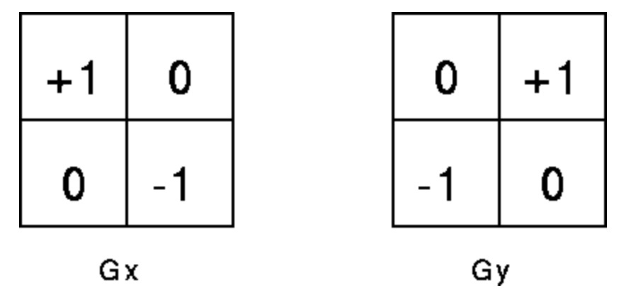
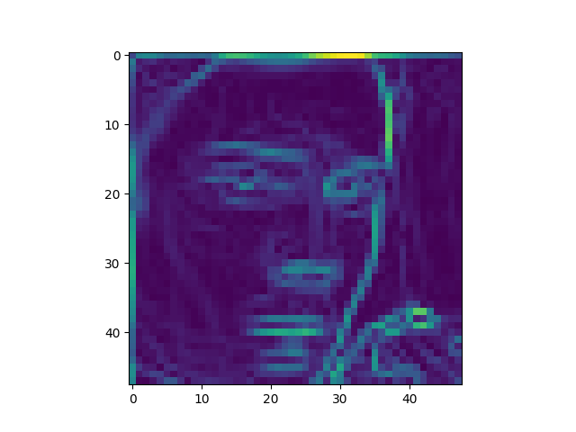
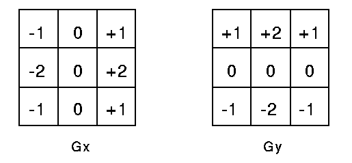
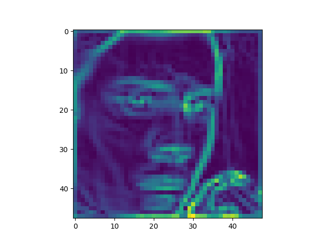

# Edge Detection

Edges are significant local changes of intensity in a digital image.

Initial image:

# Edge detection: Robert Cross Edge detector
1. The Roberts Cross operator performs a simple, quick to compute, 2-D spatial gradient measurement on an image. It thus highlights regions of high spatial frequency which often correspond to edges.

2. In theory, the operator consists of a pair of 2×2 convolution kernels as shown in Figure 1. One kernel is simply the other rotated by 90°. 

3. We apply this convolution using scipy's convolve2d to each pixel

# Result:

# Edge detection: Sobel Edge detector
1. The Sobel operator performs a 2-D spatial gradient measurement on an image and so emphasizes regions of high spatial frequency that correspond to edges.

2. In theory, the operator consists of a pair of 3×3 convolution kernels as shown in Figure .  One kernel is simply the other rotated by 90°. 

3. We apply this convolution using scipy's convolve2d to each pixel

# Result:

